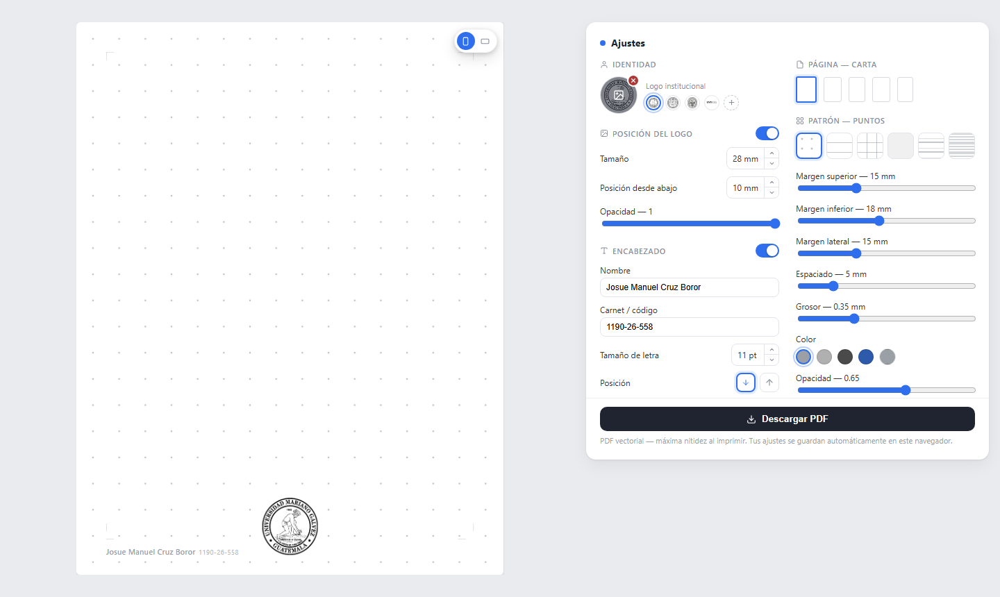
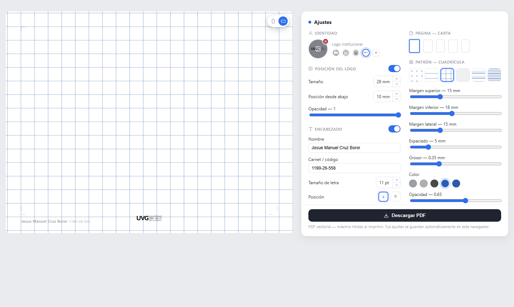
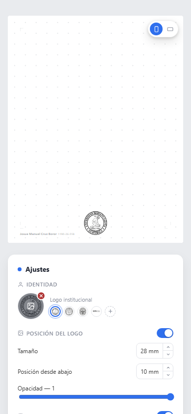

# Hojas de Puntos Personalizables

**Generador de hojas de cuaderno imprimibles** — puntos, líneas, cuadrícula, isométrico, caligrafía y pentagrama — con vista previa en vivo y exportación a PDF vectorial listo para imprimir.

🔗 **[gridj3.vercel.app](https://gridj3.vercel.app)**



---

## ¿Qué es esto?

Un cuaderno de puntos "de verdad" (como los que se compran para bullet journal, apuntes o bocetos) cuesta encontrarlo, y casi nunca trae el nombre y carnet del dueño impreso arriba, ni el logo de la universidad. Esta app resuelve eso: diseñás la hoja exactamente como la querés — patrón, tamaño de papel, márgenes, encabezado con tu nombre, logo institucional — y descargás un PDF que imprimís (o mandás a imprimir) las veces que quieras.

Pensada originalmente para estudiantes universitarios en Guatemala (por eso trae de una vez los sellos de la UMG, USAC, URL y UVG), pero sirve para cualquiera que quiera papel personalizado: apuntes de clase, bocetos, práctica de caligrafía, partituras.

## Funciones

- **6 patrones**: puntos, líneas, cuadrícula, isométrico, caligrafía (renglón + guía de altura-x) y pentagrama — cada uno con espaciado, grosor, color y opacidad ajustables, y un selector visual que muestra una miniatura real de cada uno antes de elegirlo.
- **5 tamaños de papel** (Carta, A4, Media carta, A5, Moleskine) en vertical u horizontal — la orientación se cambia con una pastilla flotante encima de la hoja, y el patrón, márgenes, encabezado y logo se reacomodan solos.
- **Encabezado con nombre y carnet**, con posición Abajo/Arriba y tamaño de letra ajustables — o arrastrándolo directamente sobre la hoja.
- **Logo institucional**: los sellos de UMG, USAC, URL y UVG ya vienen incluidos, o subís el tuyo (clic o arrastrando la imagen). Tamaño, posición y opacidad configurables, y también se puede arrastrar directo sobre la hoja.
- **Exportación a PDF vectorial**: el botón "Descargar PDF" dibuja los puntos, líneas y texto como vectores reales (no una captura de pantalla) al tamaño físico exacto del papel elegido — se ve nítido sin importar cuánto lo imprimas o hagas zoom.
- Todo se aplica en vivo sobre la vista previa y se guarda solo en el navegador (no hay cuenta ni backend).



Funciona igual de bien en el celular:



---

## Stack

- **[Astro](https://astro.build)** como framework base, con salida estática (`output: "static"`).
- **[React](https://react.dev)** para el componente interactivo (`src/components/HojasDePuntos.tsx`), montado como isla con `client:load` (renderiza en el servidor con los valores por defecto para que haya contenido visible desde el primer byte, y luego hidrata en el navegador).
- **[jsPDF](https://github.com/parallax/jsPDF)** para el PDF vectorial, cargado con `import()` dinámico solo al pulsar "Descargar PDF" — su bundle (~400&nbsp;KB, incluye `html2canvas`) no viaja en la carga inicial.
- Sin backend ni base de datos: todo corre en el navegador, con `localStorage` como única persistencia.

### Decisiones de diseño que vale la pena conocer

- **La hoja se ve a su tamaño físico real** (convertido de mm a px a 96&nbsp;dpi) y se escala con `transform: scale()` calculado en JS a partir del ancho *y* el alto disponibles — así siempre entra completa en pantalla sin scroll, en cualquier tamaño de ventana y en cualquier orientación.
- **El patrón se genera igual en la vista previa que en las miniaturas del selector**: una sola función (`patternBackground`) arma el SVG/gradiente para ambos, así nunca se desincronizan.
- **La posición del encabezado son dos presets seguros** (Abajo/Arriba), no un slider libre — para que nunca termine superpuesto con el patrón. Arrastrarlo sobre la hoja simplemente elige el preset más cercano al soltar.

## Desarrollo

```sh
npm install
npm run dev       # http://localhost:4321
```

| Comando            | Acción                                        |
| :----------------- | :--------------------------------------------- |
| `npm install`      | Instala dependencias                           |
| `npm run dev`      | Servidor de desarrollo en `localhost:4321`     |
| `npm run build`    | Build de producción a `./dist/`                |
| `npm run preview`  | Sirve el build de producción localmente        |

## Estructura

```text
/
├── public/
│   ├── logo-mariano.webp      # UMG (por defecto)
│   ├── logo-usac.webp         # USAC
│   ├── logo-url.webp          # Universidad Rafael Landívar
│   └── logo-uvg.webp          # UVG
├── src/
│   ├── components/
│   │   └── HojasDePuntos.tsx  # toda la lógica: estado, patrones, arrastre, export PDF
│   └── pages/
│       └── index.astro        # layout + estilos globales, monta el componente
└── package.json
```

## Origen

La interfaz y el comportamiento fueron diseñados como prototipo en [Claude Design](https://claude.ai/design) y portados fielmente a este stack (Astro + React + jsPDF).

Los sellos de UMG, USAC, URL y UVG son marcas de sus respectivas universidades, incluidos aquí únicamente para que cada quien identifique sus propias hojas — no implican afiliación con este proyecto.
